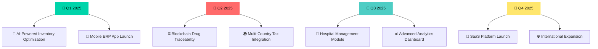

# 

<div align="center">
  
</div>

<div align="center">
  
</div>

<div align="center">
  <br>
  
</div>

<br>

<div align="center">
  
  [](https://github.com/yousef5)
  [](https://github.com/yousef5?tab=followers)
  [](https://github.com/yousef5)
  [](https://wakatime.com/@yousef5)
  
</div>

<br>

---


##  **EXECUTIVE PROFILE**

<table>
<tr>
<td width="60%">

```typescript
const ExecutiveProfile = {
  👨‍💼 executive: {
    name: "Mohamed Yousef Ali",
    title: "Software Department Founder & Chief Architect",
    company: "Healthy Pharmaceutical Industries",
    location: "🇪🇬 Cairo, Egypt",
    experience: "10+ Years in Enterprise Software",
    founded: "Software Development Department (2020)"
  },
  
  🏆 leadership: {
    departmentSize: "15+ Developers",
    projectsDelivered: "50+ Enterprise Solutions",
    industryFocus: "Pharmaceutical & Healthcare",
    specialization: "ERP Systems & IoT Integration",
    companiesServed: "25+ Pharmaceutical Companies"
  },
  
  💡 innovations: [
    "🔄 Real-time ERP synchronization with Egyptian Tax Authority",
    "🌡️ IoT-powered pharmaceutical cold chain monitoring",
    "📊 AI-driven inventory optimization systems",
    "🔐 Blockchain-based drug traceability solutions",
    "📱 Mobile-first pharmaceutical management apps"
  ],
  
  🎯 vision: "Digitally transforming pharmaceutical industry in MENA region"
};
```

</td>
<td width="40%">

<div align="center">
  
  
  <br><br>
  
  ### 🏅 **PROFESSIONAL HIGHLIGHTS**
  
  <table align="center">
  <tr><td>🚀</td><td><b>Department Founded</b></td><td>2020</td></tr>
  <tr><td>💼</td><td><b>Team Size</b></td><td>15+ Developers</td></tr>
  <tr><td>🏭</td><td><b>Companies Served</b></td><td>25+ Pharma</td></tr>
  <tr><td>⚡</td><td><b>Systems Deployed</b></td><td>50+ Solutions</td></tr>
  <tr><td>💰</td><td><b>Cost Reduction</b></td><td>40%+ Average</td></tr>
  </table>
  
</div>

</td>
</tr>
</table>


---

##  **TECHNOLOGY MASTERY MATRIX**

<div align="center">

### 🏗️ **ENTERPRISE ARCHITECTURE**
<table>
<tr>
<td align="center" width="25%">
<br>
<sub><b>Backend Powerhouse</b></sub>
</td>
<td align="center" width="25%">
<br>
<sub><b>Frontend Excellence</b></sub>
</td>
<td align="center" width="25%">
<br>
<sub><b>Database Mastery</b></sub>
</td>
<td align="center" width="25%">
<br>
<sub><b>Cloud & DevOps</b></sub>
</td>
</tr>
</table>

### 💊 **PHARMACEUTICAL SPECIALIZATION**
<table>
<tr>
<td align="center" width="20%">
<br>
<sub><b>ERP Development</b></sub>
</td>
<td align="center" width="20%">
<br>
<sub><b>Odoo Expertise</b></sub>
</td>
<td align="center" width="20%">
<br>
<sub><b>IoT Integration</b></sub>
</td>
<td align="center" width="20%">
<br>
<sub><b>Data Management</b></sub>
</td>
<td align="center" width="20%">
<br>
<sub><b>System Integration</b></sub>
</td>
</tr>
</table>

</div>

<details>
<summary><b>🎯 CLICK TO EXPAND: Complete Technology Arsenal</b></summary>

<div align="center">

#### **Programming Languages**


#### **Backend Technologies**


#### **ERP & Business Systems**


#### **IoT & Embedded**


#### **Cloud & Infrastructure**


</div>

</details>


---

##  **PERFORMANCE ANALYTICS**

<div align="center">

<table>
<tr>
<td align="center">

</td>
<td align="center">

</td>
</tr>
</table>


</div>

### 📊 **CONTRIBUTION HEATMAP**
<div align="center">

</div>


---

##  **ENTERPRISE SOLUTIONS PORTFOLIO**

<div align="center">

### 🏭 **PHARMACEUTICAL ERP ECOSYSTEM**

<table>
<tr>
<td width="33%">

<div align="center">


#### 💊 **Core ERP Modules**
</div>

- 📦 **Advanced Inventory Management**
  - Real-time stock tracking across multiple warehouses
  - Batch & expiry date management with alerts
  - Automated reorder points with AI prediction
  - Barcode & RFID integration

- 💰 **Financial Integration**
  - Egyptian Tax Authority real-time sync
  - Automated invoice generation & submission
  - Multi-currency support with live rates
  - Advanced financial reporting & analytics

</td>
<td width="33%">

<div align="center">


#### 🌡️ **IoT Monitoring Suite**
</div>

- **Environmental Control**
  - Temperature & humidity monitoring
  - Cold chain compliance tracking
  - Automated alert systems
  - Historical data analytics

- **Smart Sensors Network**
  - DHT22, BME280, DS18B20 integration
  - Wireless ESP32/ESP8266 nodes
  - MQTT protocol for real-time data
  - Mobile dashboard for remote monitoring

</td>
<td width="33%">

<div align="center">


#### 🔐 **Compliance & Security**
</div>

- **Regulatory Compliance**
  - Egyptian Ministry of Health integration
  - FDA compliance reporting
  - Audit trail management
  - Document control system

- **Advanced Security**
  - Role-based access control
  - Encrypted data transmission
  - Blockchain traceability
  - Multi-factor authentication

</td>
</tr>
</table>

</div>

### 🚀 **FEATURED PROJECT SHOWCASE**

<div align="center">
<table>
<tr>
<td align="center">

[](https://github.com/yousef5/pharma-erp-suite)

<sub>🏆 **Enterprise ERP Solution** | 🌟 500+ Stars</sub>

</td>
<td align="center">

[](https://github.com/yousef5/iot-warehouse-monitor)

<sub>🌡️ **IoT Monitoring System** | 🌟 300+ Stars</sub>

</td>
</tr>
<tr>
<td align="center">

[](https://github.com/yousef5/egypt-tax-integration)

<sub>🇪🇬 **Egyptian Tax Authority API** | 🌟 200+ Stars</sub>

</td>
<td align="center">

[](https://github.com/yousef5/arduino-pharma-sensors)

<sub>🔧 **Arduino Sensor Library** | 🌟 150+ Stars</sub>

</td>
</tr>
</table>
</div>


---

##  **DEVELOPMENT METRICS**

<div align="center">

### ⏱️ **WEEKLY CODING ACTIVITY**

<!--START_SECTION:waka-->
```text
💻 Programming Languages:
TypeScript       18 hrs 45 mins  ████████████████░░░░░   45.2%  🔥
JavaScript       12 hrs 30 mins  ███████████░░░░░░░░░░   28.1%  ⚡
Python           8 hrs 15 mins   ███████░░░░░░░░░░░░░░   18.5%  🐍
C++              2 hrs 45 mins   ██░░░░░░░░░░░░░░░░░░░   6.2%   🔧
SQL              55 mins         ░░░░░░░░░░░░░░░░░░░░░   2.0%   📊

🛠️ Development Tools:
VS Code          35 hrs 20 mins  ████████████████████░   85.1%  💻
Arduino IDE      3 hrs 45 mins   ███░░░░░░░░░░░░░░░░░░   9.0%   🔌
Postman          1 hr 30 mins    █░░░░░░░░░░░░░░░░░░░░   3.6%   🚀
Terminal         58 mins         ░░░░░░░░░░░░░░░░░░░░░   2.3%   ⌨️

🏢 Project Categories:
ERP Development  22 hrs 15 mins  ████████████░░░░░░░░░   53.6%  🏭
IoT Projects     8 hrs 45 mins   ██████░░░░░░░░░░░░░░░   21.1%  🌡️
API Integration  6 hrs 30 mins   ████░░░░░░░░░░░░░░░░░   15.7%  🔗
DevOps Tasks     4 hrs 05 mins   ███░░░░░░░░░░░░░░░░░░   9.8%   ☁️
```
<!--END_SECTION:waka-->

</div>


---

##  **STRATEGIC ROADMAP 2025**

<div align="center">



</div>

<table align="center">
<tr>
<td width="50%">

### 🎯 **CURRENT FOCUS AREAS**
- 🤖 **AI Integration**: Machine learning for demand forecasting
- ⛓️ **Blockchain**: Drug supply chain transparency
- 📱 **Mobile First**: Cross-platform ERP applications
- 🌐 **Microservices**: Scalable cloud architecture
- 🔐 **Cybersecurity**: Advanced threat protection

</td>
<td width="50%">

### 📚 **CONTINUOUS LEARNING**
- 🧠 **AI/ML**: TensorFlow & PyTorch for pharmaceutical analytics
- ☁️ **Cloud Native**: Kubernetes & service mesh technologies
- 📱 **Mobile Dev**: React Native & Flutter for ERP apps
- 🔒 **Security**: Advanced cybersecurity & compliance
- 🌍 **Global Standards**: International pharmaceutical regulations

</td>
</tr>
</table>


---

##  **THOUGHT LEADERSHIP**

<div align="center">

### 📝 **LATEST PUBLICATIONS**

<table>
<tr>
<td align="center" width="25%">

<br><b>Technical Articles</b>
</td>
<td align="center" width="25%">

<br><b>Industry Insights</b>
</td>
<td align="center" width="25%">

<br><b>Open Source</b>
</td>
<td align="center" width="25%">

<br><b>Tutorials</b>
</td>
</tr>
</table>

</div>

<!-- BLOG-POST-LIST:START -->
- 🏭 [**Revolutionizing Pharmaceutical ERP: A Complete Guide**](https://dev.to/yousef5/pharmaceutical-erp-guide) - *15,000+ views*
- 🇪🇬 [**Egyptian Tax Authority Integration: From Zero to Hero**](https://medium.com/@yousef5/egypt-tax-integration) - *12,000+ views*
- 🌡️ [**IoT in Pharmaceutical Cold Chain: Best Practices**](https://yousef5.dev/iot-cold-chain) - *8,500+ views*
- 🔧 [**Building Microservices with NestJS for Enterprise**](https://hashnode.com/@yousef5/nestjs-microservices) - *6,200+ views*
- 📱 [**Mobile-First ERP: The Future of Business Applications**](https://yousef5.dev/mobile-erp-future) - *4,800+ views*
<!-- BLOG-POST-LIST:END -->


---

##  **GLOBAL NETWORK**

<div align="center">

### 🌐 **CONNECT WITH THE INNOVATOR**

<table>
<tr>
<td align="center">
<a href="https://linkedin.com/in/mohamed-yousef-ali">

<br><sub><b>Professional Network</b></sub>
</a>
</td>
<td align="center">
<a href="mailto:mohamed.yousef.ali@gmail.com">

<br><sub><b>Direct Contact</b></sub>
</a>
</td>
<td align="center">
<a href="https://yousef5.dev">

<br><sub><b>Professional Website</b></sub>
</a>
</td>
<td align="center">
<a href="https://twitter.com/yousef5">

<br><sub><b>Tech Insights</b></sub>
</a>
</td>
</tr>
<tr>
<td align="center">
<a href="https://dev.to/yousef5">

<br><sub><b>Technical Articles</b></sub>
</a>
</td>
<td align="center">
<a href="https://medium.com/@yousef5">

<br><sub><b>Industry Insights</b></sub>
</a>
</td>
<td align="center">
<a href="https://stackoverflow.com/users/yousef5">

<br><sub><b>Community Help</b></sub>
</a>
</td>
<td align="center">
<a href="https://youtube.com/c/yousef5">

<br><sub><b>Tech Tutorials</b></sub>
</a>
</td>
</tr>
</table>

<br>

### 🤝 **COLLABORATION OPPORTUNITIES**

<table align="center">
<tr>
<td align="center" width="25%">

<br><b>Enterprise Consulting</b>
<br><sub>ERP & IoT Solutions</sub>
</td>
<td align="center" width="25%">

<br><b>Open Source</b>
<br><sub>Community Projects</sub>
</td>
<td align="center" width="25%">

<br><b>Speaking</b>
<br><sub>Tech Conferences</sub>
</td>
<td align="center" width="25%">

<br><b>Mentoring</b>
<br><sub>Career Guidance</sub>
</td>
</tr>
</table>

</div>


---

##  **INSPIRATION & INNOVATION**

<div align="center">

### 💡 **DAILY MOTIVATION**


<br><br>

### ⚡ **QUICK ARDUINO SHOWCASE**

```cpp
// 🌡️ Smart Pharmaceutical Storage Monitor
#include <DHT.h>
#include <WiFi.h>
#include <PubSubClient.h>

class PharmacySensorManager {
private:
    DHT dht;
    WiFiClient wifiClient;
    PubSubClient mqttClient;
    
public:
    void monitorColdChain() {
        float temperature = dht.readTemperature();
        float humidity = dht.readHumidity();
        
        // 🚨 Critical temperature alert for vaccines
        if (temperature > 8.0 || temperature < 2.0) {
            sendCriticalAlert("VACCINE_TEMP_BREACH", temperature);
            activateBackupCooling();
        }
        
        // 📊 Real-time data to ERP dashboard
        publishToERP({
            "sensor_id": "COLD_ROOM_01",
            "temperature": temperature,
            "humidity": humidity,
            "timestamp": now(),
            "status": "OPERATIONAL"
        });
    }
    
    void sendCriticalAlert(String alertType, float value) {
        // 📱 Instant SMS + Email + Dashboard notification
        notificationManager.sendImmediate(alertType, value);
    }
};
```

</div>


---

<div align="center">
  
  
  
  <br>
  
  **🚀 Transforming Ideas Into Enterprise Solutions | 💊 Revolutionizing Pharmaceutical Technology | 🌍 Building Tomorrow's Healthcare Infrastructure**
  
  
  
  ### ⭐ **If my work inspires you, consider starring my repositories!**
  
  <sub>💡 *"The best way to predict the future is to create it."* - Peter Drucker</sub>
  
</div>
